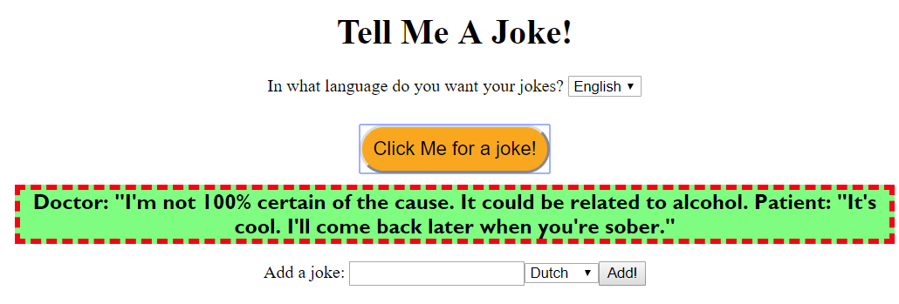

# TellMeAJoke.com
This is a web app that has a bunch of jokes, that it shows to the user when he or she clicks the button.
The jokes are fetched from a JSON file using a node server and AJAX. You can also add your own jokes. Here is a screenshot of the webpage:

